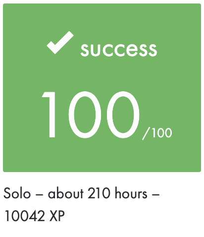
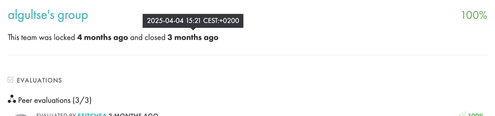
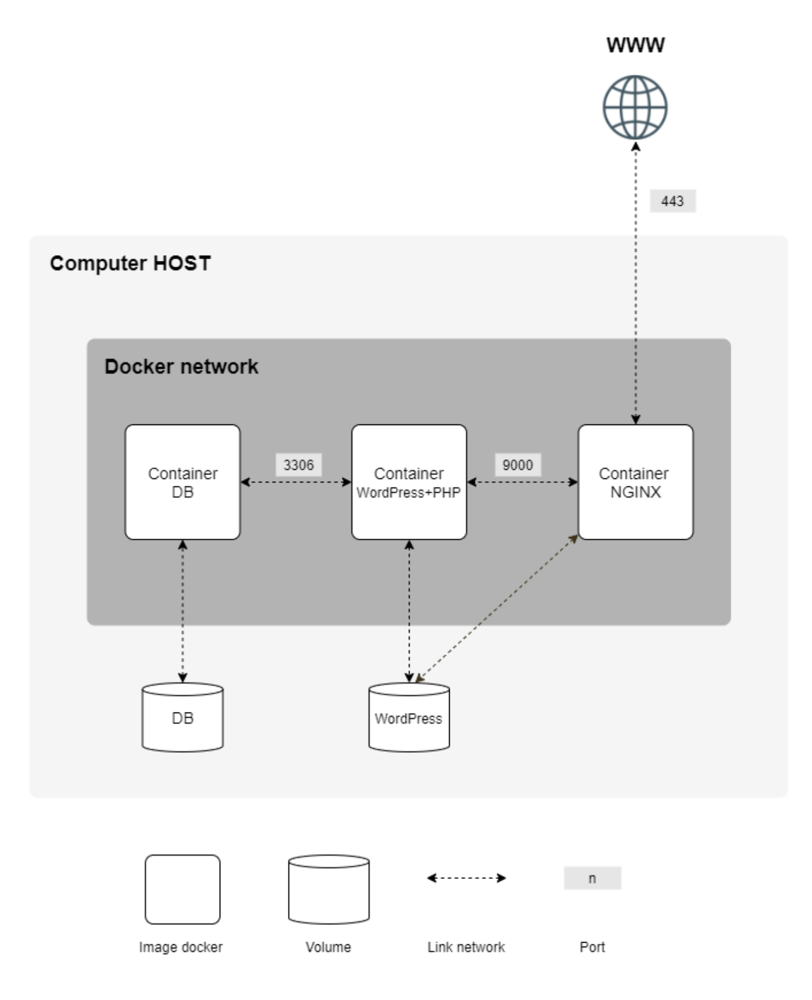

|           Grade          |                           |
|:------------------------:|:-------------------------:|
|  |  |

<br>

---

<details>
<summary>🇫🇷 FRENCH VERSION</summary>

<p align="center">
	Ceci est un <a href="./subject/Inception.fr.subject.pdf">projet</a> de l'école 42 (réalisé en avril 2025).
</p>

## Préambule
Déployer une `infrastructure web` complète à l’aide de `Docker` et `docker-compose`, composée de services isolés et sécurisés.

## Services déployés
- `NGINX` (avec TLSv1.2/v1.3, accessible uniquement sur le port 443)
- `WordPress + php-fpm` (sans NGINX intégré)
- `MariaDB` (base de données pour WordPress)
- `Volumes` persistants pour les fichiers WordPress et la base de données
- `Réseau Docker` personnalisé pour relier les conteneurs

## Compétences:
- Rédaction de `Dockerfiles` personnalisés
- Mise en place de TLS (`HTTPS`) et sécurisation de l’infrastructure
- Utilisation de `.env` et de secrets pour les variables sensibles
- Respect des bonnes pratiques Docker (pas de `tail -f`, sleep infinity, ni d’images préconstruites)

## Installation
```bash
git clone https://github.com/N0fish/inception.git
cd inception
make
```

### Pratique
- `docker ps` montre la liste des containers qui fonctionnent (`-a` montre aussi
  ceux qui sont fini)

### KILL IT
`docker kill --signal=SIGSEGV <container>`

</details>

---

<details>
<summary>🇬🇧 ENGLISH VERSION</summary>

<p align="center">
    This is a <a href="./subject/Inception.en.subject.pdf">project</a> at 42 School (completed in April 2025).
</p>

## Preamble
Deploy a full `web infrastructure` using `Docker` and `docker-compose`, with isolated and secure services.

## Deployed services
- `NGINX` (with TLSv1.2/v1.3, accessible only via port 443)
- `WordPress + php-fpm` (no built-in NGINX)
- `MariaDB` (WordPress database)
- Persistent `volumes` for WordPress files and the database
- Custom `Docker network` to connect containers

## Skills:
- Writing custom `Dockerfiles`
- Setting up TLS (`HTTPS`) and securing the infrastructure
- Using `.env` and Docker secrets for sensitive data
- Following Docker best practices (no `tail -f`, sleep infinity, or prebuilt images)

## Installation
```bash
git clone https://github.com/N0fish/inception.git
cd inception
make
```

### Pratique
- `docker ps` shows the list of running containers (`-a` also shows
those that are finished)

### KILL IT
`docker kill --signal=SIGSEGV <container>`

</details>

---

<details>
<summary>🇷🇺 RUSSIAN VERSION</summary>

<p align="center">
    Это <a href="./subject/Inception.en.subject.pdf">проект</a> в школе 42 (выполнен в апреле 2025 года).
</p>

## Преамбула
Развернуть полноценную `web-инфраструктуру` с помощью `Docker` и `docker-compose`, используя изолированные и безопасные контейнеры.

## Развёрнутые сервисы
- `NGINX` (с TLSv1.2/v1.3, доступен только на порту 443)
- `WordPress + php-fpm` (без встроенного NGINX)
- `MariaDB` (база данных WordPress)
- Постоянные тома (`volumes`) для базы данных и файлов сайта
- Собственная `docker-сеть` для связи контейнеров

## Навыки:
- Написание `Dockerfile` для каждого сервиса
- Настройка TLS (`HTTPS`) и защита инфраструктуры
- Использование `.env` и Docker secrets
- Соблюдение best practices (без `tail -f`, sleep infinity, готовых образов)

## Установка
```bash
git clone https://github.com/N0fish/inception.git
cd inception
make
```

### Pratique
-- `docker ps` показывает список запущенных контейнеров (`-a` также показывает
те, которые завершены)

### KILL IT
`docker kill --signal=SIGSEGV <container>`

</details>

---

<br>

## Infrastructure
